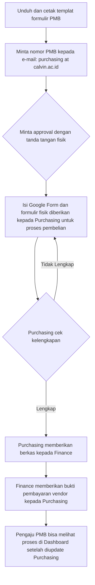

# Flowchart PMB

## Cara Request PMB

```mermaid
    flowchart TD;
      
        A0[Unduh dan cetak templat formulir PMB]
        B0[Minta nomor PMB kepada e-mail: purchasing at calvin.ac.id]
        C0{Minta approval dengan tanda tangan fisik}
        D0[Isi Google Form dan formulir fisik diberikan kepada Purchasing untuk proses pembelian]
        E0{Purchasing cek kelengkapan}
        F0[Purchasing memberikan berkas kepada Finance]
        G0[Finance memberikan bukti pembayaran vendor kepada Purchasing]
        H0[Pengaju PMB bisa melihat proses di Dashboard setelah diupdate Purchasing]
        
        A0 --> B0
        B0 --> C0
        C0 --> D0
        D0 --> E0
        E0 -- Lengkap ----> F0
        E0 -- Tidak Lengkap ----> D0
        F0 --> G0
        G0 --> H0

        click A0 "https://drive.google.com/file/d/1n_CrbAWdl9e3U0lypXBaHdNXq3IAsnV4/view?usp=sharing" "Open this in a new tab" _blank
        click C0 "https://drive.google.com/file/d/1k9oI7VEglaBNFH8Zs5ReXn0smp41Pl-3/view" "Open this in a new tab" _blank
        click D0 "https://docs.google.com/forms/d/e/1FAIpQLScA17F4A_zZG7xg4NweWRKz_1dTxN_oeLB1EFTO6JiE23Zg2g/viewform" "Open this in a new tab" _blank
 
```
